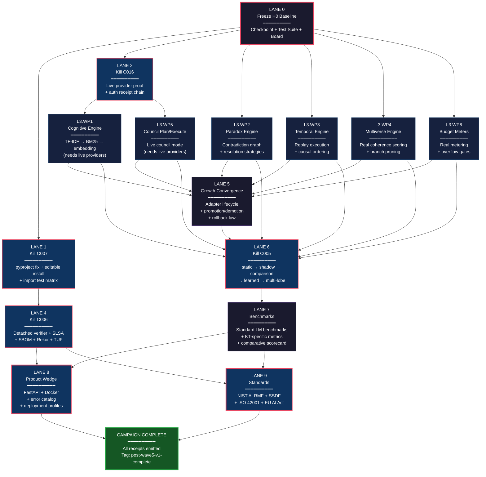

# SUPERSEDED — DOCUMENTARY ONLY

Superseded by `KT_POST_WAVE5_MAX_POWER_RECTIFICATION_CAMPAIGN_FINAL_V3_1`.
Retained for lineage only. Do not use as live scheduler.

# KT Post-Wave5 Rectification — Lane-by-Lane Execution DAG

## Overview

10 lanes, 4 contradictions, strict dependency enforcement.
Critical path: L0 → L2 → L3 → L5 → L6 → L7 → L8/L9 (8 serial links minimum).

---

## Lane Dependency Matrix

| Lane | Depends On | Contradiction | Parallel Group |
|------|-----------|---------------|----------------|
| L0 — Freeze H0 Baseline | — | — | G0 (solo) |
| L1 — Canonical Install (C007) | L0 | C007 | G1 (parallel with L2) |
| L2 — Live Provider Proof (C016) | L0 | C016 | G1 (parallel with L1) |
| L3 — Organ Ignition (6 WPs) | L0, L2 (WP1/WP5 only) | — | G2 (internal parallelism) |
| L4 — Externality Upgrade (C006) | L1 | C006 | G2 (parallel with L3) |
| L5 — Growth Convergence | L3 | — | G3 |
| L6 — Router Ratification (C005) | L3, L5 | C005 | G4 |
| L7 — Benchmarks & Challenge | L3, L6 | — | G5 |
| L8 — Product Wedge | L4, L7 | — | G6 (parallel with L9) |
| L9 — Standards Alignment | L4, L7 | — | G6 (parallel with L8) |

---

## Execution DAG (Mermaid)



---

## Parallel Groups (Scheduling View)

### G0 — Gate Zero (must complete before anything)
```
┌─────────────────────────────────┐
│  LANE 0: Freeze H0 Baseline    │
│  • git tag h0-baseline-freeze   │
│  • pytest full suite            │
│  • organ status board snapshot  │
│  • execution board frozen       │
└─────────────────────────────────┘
                │
                ▼
```

### G1 — First Parallel Fork (after L0)
```
┌──────────────────────┐     ┌──────────────────────┐     ┌──────────────────┐
│  LANE 1: Kill C007   │     │  LANE 2: Kill C016   │     │  L3.WP2 Paradox  │
│  pyproject.toml fix  │     │  Live provider proof  │     │  L3.WP3 Temporal │
│  editable install    │     │  Auth receipt chain   │     │  L3.WP4 Multi    │
│  import test matrix  │     │  TLS cert pin verify  │     │  L3.WP6 Meters   │
└──────────┬───────────┘     └──────────┬───────────┘     └────────┬─────────┘
           │                            │                          │
           ▼                            ▼                          │
   ┌───────────────┐          ┌─────────────────┐                 │
   │  LANE 4       │          │  L3.WP1 Cognit. │                 │
   │  Kill C006    │          │  L3.WP5 Council  │                 │
   │  Detached     │          └────────┬────────┘                 │
   │  verifier     │                   │                          │
   └───────┬───────┘                   ▼                          │
           │              ┌─── ALL L3 WPs COMPLETE ◄──────────────┘
           │              │
           │              ▼
```

### G3 — Growth (strict sequence begins)
```
           │    ┌──────────────────────────┐
           │    │  LANE 5: Growth Stack    │
           │    │  Adapter lifecycle       │
           │    │  Promotion/demotion      │
           │    │  Rollback law            │
           │    └────────────┬─────────────┘
           │                 │
           │                 ▼
           │    ┌──────────────────────────┐
           │    │  LANE 6: Kill C005       │
           │    │  Static → Shadow →       │
           │    │  Comparison → Learned    │
           │    │  → Multi-lobe routing    │
           │    └────────────┬─────────────┘
           │                 │
           │                 ▼
           │    ┌──────────────────────────┐
           │    │  LANE 7: Benchmarks      │
           │    │  Standard LM + KT-spec   │
           │    │  Comparative scorecard   │
           │    │  With failed rows kept   │
           │    └────────────┬─────────────┘
           │                 │
           ▼                 ▼
```

### G6 — Final Parallel (after L4 + L7)
```
┌──────────────────────────┐     ┌──────────────────────────┐
│  LANE 8: Product Wedge   │     │  LANE 9: Standards       │
│  FastAPI wrapper          │     │  NIST AI RMF mapping     │
│  Dockerfile + compose     │     │  SSDF 800-218/218A       │
│  Error catalog            │     │  ISO 42001 annex         │
│  Deployment profiles      │     │  EU AI Act mapping       │
└──────────────┬───────────┘     └──────────────┬───────────┘
               │                                │
               ▼                                ▼
       ┌───────────────────────────────────────────────┐
       │            CAMPAIGN COMPLETE                   │
       │  Tag: post-wave5-maxpower-rectification-v1     │
       │  All AUDITS/ receipts emitted                  │
       │  Final execution board published               │
       └───────────────────────────────────────────────┘
```

---

## Critical Path Analysis

**Longest sequential chain (determines minimum calendar time):**

```
L0 → L2 → L3.WP1 → L5 → L6 → L7 → L8
 │         L3.WP5 ↗                  └→ L9
 │
 └→ (also) L3.WP2, L3.WP3, L3.WP4, L3.WP6 (parallel with L2)
```

**8 serial links on the critical path.**

Off-critical-path work (can lag without blocking):
- L1 (only blocks L4)
- L4 (only blocks L8/L9, which also need L7)
- L3.WP2/WP3/WP4/WP6 (can start immediately after L0, don't need L2)

---

## Lane Duration Estimates (Relative T-Shirt Sizing)

| Lane | Size | Estimated FTE-Days | Parallelizable |
|------|------|--------------------|----------------|
| L0 | XS | 0.5 | No (gating) |
| L1 | S | 1-2 | Yes (with L2) |
| L2 | M | 2-3 | Yes (with L1) |
| L3 | XL | 8-12 (6 WPs) | Internal parallelism |
| L4 | L | 4-6 | Yes (with L3) |
| L5 | M | 3-4 | No (sequential) |
| L6 | XL | 8-12 | No (sequential) |
| L7 | L | 4-6 | No (sequential) |
| L8 | M | 3-4 | Yes (with L9) |
| L9 | M | 2-3 | Yes (with L8) |
| **Total** | | **~36-52 FTE-Days** | |
| **Critical path** | | **~28-40 FTE-Days** | |

---

## Gate Verification Checkpoints

After each lane, verify before proceeding:

| Gate | Check | Method |
|------|-------|--------|
| G0_EXIT | H0 baseline frozen, all tests green | `pytest tests/ -v` + tag exists |
| G1_EXIT | `pip install -e .` works + all imports resolve | Import test matrix |
| G2_EXIT | Live provider receipt exists with real response hash | Receipt file in AUDITS/ |
| G3_EXIT | All 6 organs score above baseline on unit tests | Per-WP test suite |
| G4_EXIT | Detached verifier runs on separate host, receipt chained | Cross-host log comparison |
| G5_EXIT | Adapter promotion/demotion cycle runs end-to-end | Integration test |
| G6_EXIT | Static→shadow→comparison routing proves uplift | Comparative scorecard |
| G7_EXIT | Benchmark scorecard with failed rows preserved exists | File in reports/ |
| G8_EXIT | `docker-compose up` serves health endpoint | HTTP 200 on /health |
| G9_EXIT | NIST + ISO + EU AI Act mappings filed | Files in governance/ |

---

## Files Referenced

- **Work Order (law):** `KT_PROD_CLEANROOM/kt.post_wave5_maxpower_rectification.v1.json`
- **Codex Prompt:** `KT_PROD_CLEANROOM/CODEX_MASTER_PROMPT_POST_WAVE5_V1.md`
- **This DAG:** `KT_PROD_CLEANROOM/EXECUTION_DAG_POST_WAVE5_V1.md`
